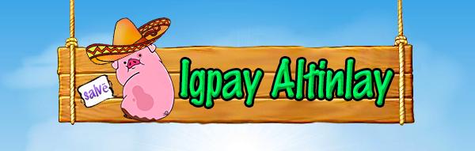
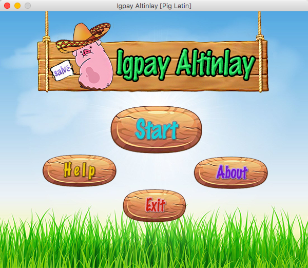
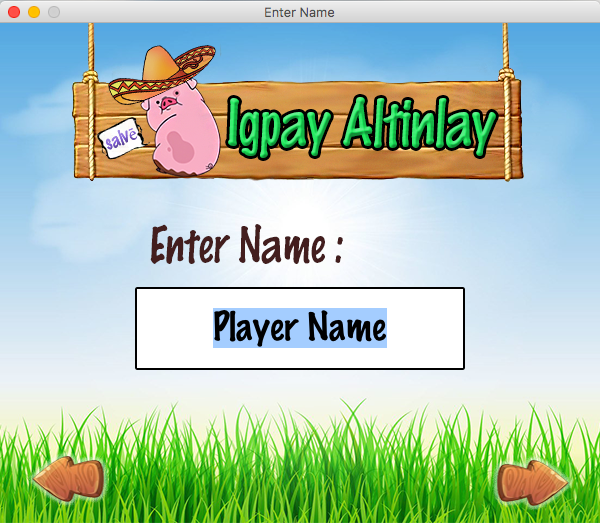
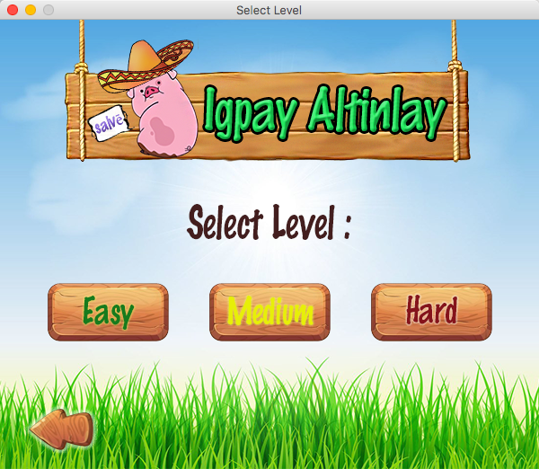
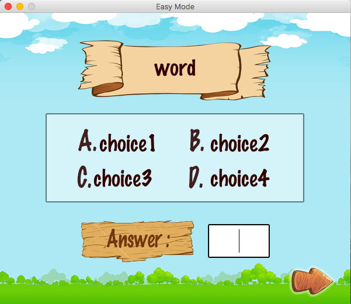
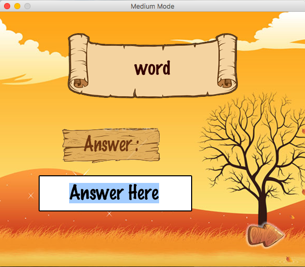
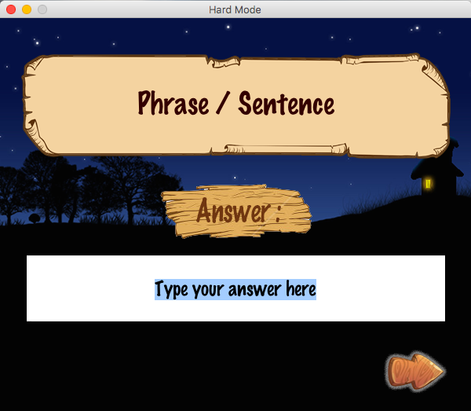
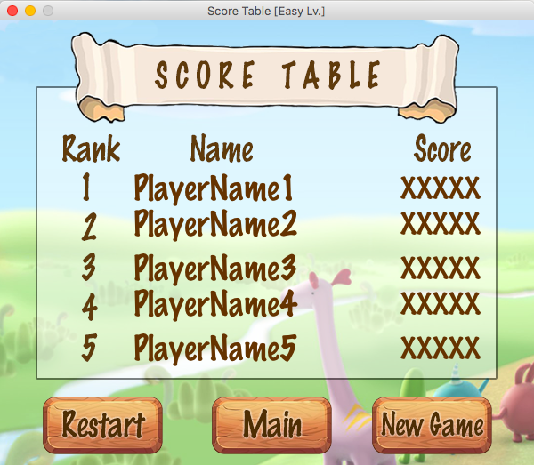

# Igpay Atinlay ( Pig Latin )

**Table of Contents**
- [What is Igpay Atinlay?](#What-is-Igpay-Atinlay)
- [How to play?](#How-to-play)
- [How to download?](#How-to-download)
- [Contributors](#Contributors)

## What is Igpay Atinlay?
This application is a language game that words in English are altered by adding a fabricated suffix or by moving the onset or initial consonant or consonant cluster of a word to the end of the word and adding a vocalic syllable to create such a suffix.
    

## How to play?
**1.** Click **Start** button

**2.** Type your name then click :arrow_right: button (or click :arrow_left: button to go back to main menu )

**3.** Select level you want to play (If you want to change player name click :arrow_left: button)

- **Easy**

    In easy mode, we'll give a word and choices for players. The players need to choose a correct answer and type letter into the answer box.
        

        
- **Medium**

    In medium mode, we'll only give a word to players and the players need to type a correct answer into the answer box below.
    

    
- **Hard**

    In hard mode, we'll give a phrase or a sentence to players and the players need to type a correct answer into the answer box below.
        

        
    
### Score Table
The score table will show top 5 player's names and scores.
    

    
### More buttons features :
- click **Help** button to read described of the game and see some examples.
- click **About** button to read credits of the game.
- click **Restart** button to restart the game with level you're selected before.
- click **Main** button to go back to main menu of the game.
- click **New Game** button to have new game (link back to input player's name window).
- click **Exit** button to exit the game.

## How to download the game?
// TODO put step and other info later.

## Contributors
   - [**Kunyaruk Katebunlu**](https://github.com/NokKbl) ( ID : 6010545692 )
   - [**Vichakorn Yotboonrueang**](https://github.com/Newaz2542) ( ID : 6010545889 )
   
**Note**
    This game application is a project of Programming 1 course for the first semester which created by students in Faculty of Software and Knowledge Engineering, Kasetsart University.
